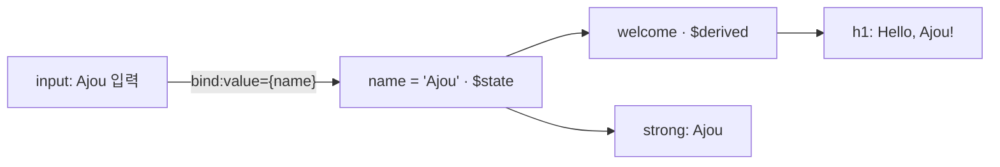
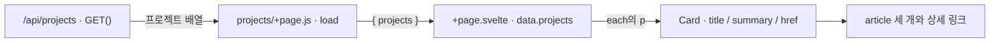
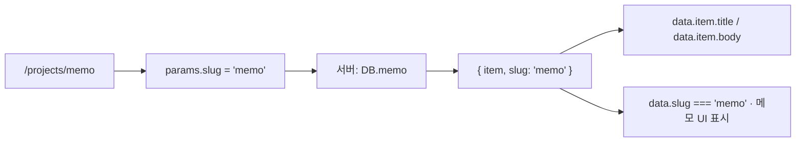

# 02회차 실습 내용과 슬라이드 제작 기준

현재 기준 갱신: 2026-09-14

전체 슬라이드 수정과 영문 작성에 사용한 실습 기준은 커밋 `5f4456240702bc6b599b83e91f9ecd816f90a1fb`의 추적 파일 30개입니다. Node.js 24.x, Svelte 5.57.0, SvelteKit 2.70.3, Vite 7.3.6, adapter-auto 6.1.1을 확인했습니다. README의 새 프로젝트 생성 명령은 `npx sv@0.17.0 create pwd-week2`이며, 제공된 실습 소스의 실행은 `npm ci`와 `npm run dev`를 사용합니다. 검토 기록은 [출처 기록](final-review/practice-package.json)과 [슬라이드 수정 결과](../completion-review-2026-09-14.md)에 있습니다. 검토용 ZIP과 별도 영문 실습 안내는 배포하지 않습니다. 소스 검토상 서버 load와 API를 포함하지만, 사용자가 확정한 원본 학습 목표·요구사항을 임의로 바꾸지 않습니다.

아래는 2026-09-11 검토 당시의 기록입니다. 당시 커밋·버전·README 개선 필요 사항은 이력이며 위 현재 기준보다 우선하지 않습니다. 기능 대응표와 실행 관찰은 현재 소스와 다시 대조해 슬라이드에 반영했습니다.

기록 검토일: 2026-09-11

이 문서는 사용자가 지정한 `pwd-week2` 저장소의 README·실제 코드·로컬 실행 결과를 정리한 실습 기준 자료다. 실습은 **Svelte 5·SvelteKit으로 미니 포트폴리오를 만들고, GitHub에 코드를 올려 Vercel에 배포하는 과정**이다. 현재 강의 폴더의 React 예제와 세 HTML 파일 예제는 이 실습의 구현을 대신하지 않는다.

이번 검토에서는 실습 저장소와 슬라이드를 수정하지 않았다. 실행 검사는 저장소의 추적 파일 30개를 복사한 임시 작업 폴더에서 진행했다. 실제 배포와 GitHub 연동은 실행하지 않았으므로 완료 여부를 단정하지 않는다.

## 1. 근거와 확인 범위

| 항목 | 확인한 내용 |
| --- | --- |
| 원본 경로 | `C:\Users\hsoh\Workspace\pwd-2026-practices\pwd-week2` |
| 기준 커밋 | `e13f2b6c036eab19fd8247b0c11ec316c424165f` |
| 커밋 날짜 | 2025-09-08 — 2026년 수업 안내로 사용할 때 설치·배포 설명 재점검 필요 |
| 작업 상태 | 검토 전후 `git status --short` 출력 없음 |
| 교육 의도 | 저장소 `README.md`의 실습 개요, Step 1–7, 제출 체크리스트 |
| 구현 근거 | `src/routes/`, `src/lib/Card.svelte`, `src/app.css`, 프로젝트 설정과 잠금 파일 |
| 실행 환경 | Windows, Node.js 24.12.0, npm 11.19.1, Chrome 152.0.7977.84 |
| 실행 결과 | [브라우저 관찰 기록](practice-review/browser-observations.json), [API 응답](practice-review/api-projects.json), [초기 HTML 응답](practice-review/projects-response.html.txt) |

이하 소스 경로와 줄 번호는 위 실습 저장소 기준이다. 최신 공식 문서는 프레임워크 동작과 외부 서비스 안내를 검증할 때 사용했으며, 현재 저장소에 없는 기능을 실습 범위에 추가하는 근거로 사용하지 않았다.

## 2. 실습의 목적과 결과물

README에 명시된 목표는 Node.js·npm 환경 구축, SvelteKit 사이트 제작, Git/GitHub 버전 관리, Vercel 자동 배포다. README의 예상 소요 시간은 2–3시간이며, 실제 수업에서 측정한 시간은 아니다.

완성 대상은 다음 기능을 가진 **하나의 SvelteKit 프로젝트**다.

| 주소 | 실제 화면·기능 | 핵심 소스 |
| --- | --- | --- |
| `/` | 이름 입력에 따라 인사말과 미리보기 변경, 랜덤 메시지 알림 | `src/routes/+page.svelte` |
| `/about` | 사이트 목적과 학습 주제를 제목·문단·목록으로 표시 | `src/routes/about/+page.svelte` |
| `/projects` | API에서 가져온 프로젝트 세 개를 카드로 표시 | `src/routes/projects/+page.js`, `+page.svelte`, `src/lib/Card.svelte` |
| `/projects/timetable` | Timetable Helper의 제목·설명 표시 | `src/routes/projects/[slug]/+page.server.js`, `+page.svelte` |
| `/projects/gallery` | Image Gallery의 제목·설명 표시 | 같은 `[slug]` 파일 두 개 |
| `/projects/memo` | 제목·설명, 메모 입력·저장·다시 불러오기 | 같은 `[slug]` 파일 두 개와 `localStorage` |
| `/api/projects` | 프로젝트 목록 JSON 반환 | `src/routes/api/projects/+server.js` |

Home·About·Projects는 상위 메뉴 세 개다. 실제 결과물에는 동적 상세 페이지와 API도 있으므로 ‘HTML 파일 세 개만 만드는 과제’로 축소하면 실습을 잘못 설명하게 된다.

Timetable Helper와 Image Gallery는 현재 **소개 텍스트를 표시하는 상세 페이지**다. 시간표 편집 기능이나 이미지 갤러리 기능은 구현되어 있지 않다. 메모 기능은 실제로 구현되어 있다.

제출물은 README 기준 **GitHub 저장소 URL과 Vercel 배포 URL**이다. 평가 항목은 버전 관리, GitHub–Vercel 자동 배포 연결, 제시한 사이트 코드의 정상 동작이다. 추가 콘텐츠·기능은 자율 확장으로 적혀 있다. 이 README에는 제출 기한이 없다.

## 3. 학생이 수행하는 작업

다음은 실습 README에 적힌 작업 순서다. 슬라이드의 장 번호나 수업 시간을 새로 확정한 것이 아니다.

| 단계 | 학생의 작업 | 완료를 확인하는 결과 |
| --- | --- | --- |
| 1 | Node.js·npm 설치 및 버전 확인 | 터미널에서 버전 출력 |
| 2 | `npx sv create pwd-week2`로 SvelteKit 프로젝트 생성, 개발 서버 실행 | 로컬 주소에서 생성된 프로젝트 확인 |
| 3 | GitHub에 `pwd-week2` 저장소 생성 | 본인의 저장소 URL 확보 |
| 4 | Git 초기화·첫 커밋·원격 연결·push | GitHub에서 프로젝트 파일과 커밋 확인 |
| 5 | 공통 스타일·레이아웃, Home, About, Card, API, 목록, 상세·메모 코드 작성 | 각 주소와 상호작용 정상 동작 |
| 6 | 작성한 코드 커밋·push | 변경한 코드가 원격 저장소에 반영 |
| 7 | Vercel에서 GitHub 저장소 Import, 배포, 후속 push에 따른 재배포 확인 | 실제 배포 URL과 배포 기록 확인 |

기존 저장소의 동작을 재현할 때는 새 프로젝트 생성과 구분하여 다음 명령을 사용했다.

```powershell
# 기존 pwd-week2 폴더에서 실행
node -v
npm.cmd -v
npm.cmd ci
npm.cmd run dev
```

`npm ci`는 저장소의 잠금 파일에 맞춰 설치한다. 이번 검토에서는 다른 서비스의 포트와 겹치지 않도록 `npm.cmd run dev -- --host 127.0.0.1 --port 4192 --strictPort`를 사용했다. 4192는 검토용 주소이며 실습의 필수 포트가 아니다. 서버 종료는 Ctrl+C다.

현재 잠금 파일의 버전은 Svelte **5.38.7**, SvelteKit **2.37.1**, Vite **7.1.4**, `adapter-auto` **6.1.0**이다. `package.json`의 허용 범위와 잠금 파일의 실제 버전을 혼동하지 않는다. 설치된 Vite 7.1.4의 Node 요구 범위는 `^20.19.0 || >=22.12.0`이며 이번 검토 환경은 그 범위에 해당한다.

## 4. 파일·코드·화면의 대응

```text
src/
├─ app.html                         문서 바깥 틀, SvelteKit head/body 삽입 위치
├─ app.css                          전역 스타일, .card와 nav/main 스타일
├─ lib/
│  └─ Card.svelte                   제목·설명·링크를 받는 카드
└─ routes/
   ├─ +layout.svelte                모든 페이지의 nav/main, 공통 head
   ├─ +page.svelte                  Home 상태·파생값·바인딩·이벤트
   ├─ about/+page.svelte            About의 의미 있는 문서 구조
   ├─ api/projects/+server.js       GET /api/projects
   └─ projects/
      ├─ +page.js                   목록 데이터를 가져오는 load
      ├─ +page.svelte               each 반복과 Card 호출
      └─ [slug]/
         ├─ +page.server.js         slug로 상세 데이터를 선택하는 서버 load
         └─ +page.svelte            상세 표시, memo 조건부 UI와 저장·복원
```

### 4.1 공통 레이아웃과 시맨틱 HTML

`src/routes/+layout.svelte` 3–4, 12–20행에서 `children`을 받아 공통 `nav` 아래의 `main` 안에 해당 페이지를 렌더링한다.

```svelte
<script>
  let { children } = $props();
</script>

<nav>
  <a href="/">Home</a>
  <a href="/about">About</a>
  <a href="/projects">Projects</a>
</nav>

<main>
  {@render children()}
</main>
```

이 코드는 파일의 관련 부분을 발췌한 것이다. 같은 파일의 `svelte:head`에서 `AJOU Mini Portfolio`라는 공통 제목과 설명을 지정하고, 전역 CSS를 연결한다.

| 실제 요소 | 파일 | 이 실습에서 표현하는 내용 |
| --- | --- | --- |
| `nav` | `+layout.svelte` | Home·About·Projects 탐색 |
| `main` | `+layout.svelte` | 선택한 페이지의 핵심 내용 |
| `section`, `h2`, `p`, `ul`, `li` | `about/+page.svelte` | 사이트 소개와 학습 주제 목록 |
| `article`, `h3`, `a`, `p` | `Card.svelte` | 프로젝트 한 항목의 제목·상세 링크·요약 |
| `label`, `input` | Home의 `+page.svelte` | 이름 입력과 입력 항목의 설명 |

시맨틱 HTML 설명은 실제 화면의 위 영역과 해당 태그를 연결할 수 있다. `.card`는 스타일을 적용하는 클래스이며 About의 `section`과 프로젝트의 `article` 양쪽에 사용된다. 같은 시각 스타일을 사용해도 요소가 나타내는 문서상의 역할은 구분할 수 있다.

현재 구현에는 `header`·`footer`가 없다. 이를 설명에 추가한다면 **확장 예시**라고 표시해야 한다. 현재 코드에는 메뉴를 세 파일에 복사한 단계도 없다. 메뉴의 공통화는 이미 `+layout.svelte`로 구현되어 있다. SvelteKit의 레이아웃은 하위 페이지에 적용되며 공통 컴포넌트를 페이지 이동 간 유지한다. [SvelteKit Routing](https://svelte.dev/docs/kit/routing)

### 4.2 Home: 상태·파생값·바인딩·이벤트

`src/routes/+page.svelte`의 핵심 대응은 다음과 같다.

```svelte
<script>
  let name = $state('');
  let welcome = $derived(name ? `Hello, ${name}!` : 'Welcome!');
</script>

<h1>{welcome}</h1>
<label>
  Your name: <input placeholder="type your name" bind:value={name} />
</label>
<p>미리보기: <strong>{name || '(입력 대기)'}</strong></p>
```



위 발췌와 별도로, 같은 파일 6–9, 19행의 `randomize()`·`onclick`이 배열의 메시지 하나를 골라 `alert`로 표시한다. 실제 버튼 문구는 `Random Message`이며 README 코드에는 ‘랜덤 메시지’로 적혀 있다. 슬라이드에는 어떤 버전의 화면을 사용하는지 맞춰야 한다.

이 실습에서 상태 변화는 Svelte의 상태·바인딩으로 작성한다. 앞선 개념 설명의 `querySelector`·`textContent` 예제를 이 실습의 실제 코드라고 표시하지 않는다.

### 4.3 프로젝트 목록: API → load → data → Card

실제 API는 다음 세 항목을 반환한다. [검토 시 받은 JSON](practice-review/api-projects.json)

| slug | title | summary | 카드의 링크 |
| --- | --- | --- | --- |
| `timetable` | Timetable Helper | 수업/일정 정리 도우미 | `/projects/timetable` |
| `gallery` | Image Gallery | 미니 이미지 갤러리 | `/projects/gallery` |
| `memo` | Memo Pad | 로컬에 메모 저장 | `/projects/memo` |

`src/routes/api/projects/+server.js`는 배열을 선언하고 `GET()`에서 `json(projects)`를 반환한다. `src/routes/projects/+page.js`는 이를 읽는다.

```javascript
export async function load({ fetch }) {
  const res = await fetch('/api/projects');
  return { projects: await res.json() };
}
```

`src/routes/projects/+page.svelte`의 관련 부분:

```svelte
<script>
  import Card from '$lib/Card.svelte';
  let { data } = $props();
</script>

{#each data.projects as p}
  <Card title={p.title} summary={p.summary} href={`/projects/${p.slug}`} />
{:else}
  <p class="card">아직 등록된 프로젝트가 없습니다.</p>
{/each}
```

호출되는 `src/lib/Card.svelte`:

```svelte
<script>
  let { title, summary, href } = $props();
</script>

<article class="card">
  <h3><a href={href}>{title}</a></h3>
  <p>{summary}</p>
</article>
```



API 호출부터 실제 화면까지 세 개의 데이터가 어떻게 전달되는지가 컴포넌트 설명의 근거다. React의 `ProjectCard.jsx`, 입력 `title`만 있는 카드 두 개, 직접 작성한 `history.pushState` 라우터는 이 저장소의 코드가 아니다.

### 4.4 동적 상세: URL → params → 서버 데이터 → 화면

`src/routes/projects/[slug]/+page.server.js` 10–15행:

```javascript
export function load({ params }) {
  const key = params.slug;
  const item = DB[key];
  if (!item) throw error(404, 'Not found');
  return { item, slug: key };
}
```



`DB`는 이 파일에 선언된 JavaScript 객체다. 외부 데이터베이스를 연결한 코드가 아니다. 목록용 배열과 상세용 객체는 별도로 작성되어 있으므로 항목을 추가하려면 두 데이터의 slug를 맞춰야 한다.

실제로 `/projects/not-a-project`는 HTTP 404와 `Not found`를 반환했다. 파일시스템 라우팅의 `[slug]`와 데이터에 존재하는 slug의 범위를 함께 구분해야 한다.

### 4.5 Memo: 입력·명시적 저장·복원

`src/routes/projects/[slug]/+page.svelte`의 상태·저장·복원 코드:

```javascript
let memo = $state('');

$effect(() => {
  if (data.slug === 'memo') {
    const saved = localStorage.getItem('memo');
    if (saved) memo = saved;
  }
});

function save() {
  localStorage.setItem('memo', memo);
  alert('저장 완료!');
}
```

`textarea`의 `bind:value={memo}`가 입력을 상태에 반영하고, 버튼의 `onclick={save}`가 저장을 수행한다. 검토 결과:

- `Week 2 review memo` 입력 후 저장 → `localStorage['memo']`에 같은 문자열 기록
- 새로고침 → 저장한 문구 복원
- 이후 `Unsaved draft`를 입력하고 저장하지 않은 채 새로고침 → 이전에 저장한 문구 복원
- 별도 브라우저 컨텍스트 → 빈 입력란

따라서 ‘입력할 때마다 자동 저장’ 또는 ‘서버에 메모 저장’으로 설명하면 안 된다. `$effect`가 실행되는 곳은 브라우저다. 초기 서버 렌더링에서 `localStorage`를 읽는 것으로 그리지 않는다. [Svelte $effect](https://svelte.dev/docs/svelte/$effect)

## 5. 렌더링·이동에서 실제로 확인한 차이

설정에는 `ssr = false`, `csr = false`, `prerender = true`가 없다. `adapter-static`도 사용하지 않는다. 현재 코드를 ‘정적 HTML만 배포하는 사이트’나 ‘명시적으로 구성한 SSG 실습’으로 설명할 근거는 없다.

| 관찰 | 실제 결과 | 설명 시 주의점 |
| --- | --- | --- |
| JavaScript를 끄고 `/projects` 직접 열기 | 최초 HTML에 프로젝트 카드 세 개 포함 | 빈 HTML에 브라우저가 처음부터 목록을 채우는 사례로 그리지 않음 |
| `/about`에서 `/projects` 메뉴 이동 | 관찰 구간에서 document 요청 없음, `/api/projects` fetch 발생 | 새 HTML 문서 요청과 데이터 요청을 구분 |
| 목록에서 Timetable 상세 이동 | `/projects/timetable/__data.json` fetch 발생 | 상세 데이터는 `+page.server.js`의 서버 load 경로 |
| Memo 직접 열기, JavaScript 비활성화 | 제목·본문·빈 textarea 표시 | 로컬 메모 복원과 버튼 동작에는 브라우저 실행 필요 |

`+page.js`는 universal load이고 `+page.server.js`는 서버 전용 load다. 기본 설정에서 universal load는 최초 SSR과 hydration에 참여하며, hydration 때 서버에서 얻은 fetch 응답을 재사용할 수 있다. 이후 클라이언트 이동에서는 브라우저에서 실행된다. [SvelteKit Loading data](https://svelte.dev/docs/kit/load)

실제 `src/app.html`에는 `data-sveltekit-preload-data="hover"`가 있다. 따라서 요청이 클릭 전에 미리 발생할 수 있다. 위 표는 이번 실행의 관찰 결과이며 모든 이동에서 요청 횟수·타이밍이 동일하다고 일반화하지 않는다. [SvelteKit Link options](https://svelte.dev/docs/kit/link-options)

## 6. 빌드·검사 결과와 정리할 문제

| 검사 | 결과 | 해석 |
| --- | --- | --- |
| 잠금 파일로 `npm ci` | 성공, 206개 패키지 설치 | 원본 소스·잠금 파일 수정 없이 재현 |
| `npm run check` | 오류 0, 경고 0 | Svelte 검사 통과 |
| `npm run build` | 성공 | SSR·클라이언트 번들 생성. 로컬 `adapter-auto`의 배포 환경 미검출 안내가 있으며 Vercel 배포 성공을 의미하지 않음 |
| `npm run lint` | 실패 | Prettier가 24개 파일의 서식 불일치 보고. 이 단계에서 중단되어 ESLint는 실행되지 않음 |
| ESLint 별도 실행 | 오류 5개 | 링크 관련 규칙 4개, each key 규칙 1개 |
| `npm run test:unit -- --run` | 1개 통과 | `1 + 2 = 3` 테스트이며 실습 기능을 검증하지 않음 |
| 기존 E2E 테스트 | 1개 통과 | Home의 h1 존재만 검사. 복사본에서 포트 4193·설치된 Chrome으로 설정을 조정하여 실행 |
| 별도 브라우저 동작 확인 | 통과 | Home, API 카드 3개, 상세, 메모 저장·복원, 초기 HTML, 404 확인. 클라이언트 JS 예외 없음 |
| Vercel 배포·재배포 | 미실행 | 계정·연결·배포 결과는 별도 확인 대상 |

ESLint 오류 위치는 `Card.svelte:7`, `+layout.svelte:13–15`의 `svelte/no-navigation-without-resolve`, `projects/+page.svelte:8`의 `svelte/require-each-key`다. 루트 경로에서 실행된 링크는 동작했지만 저장소가 선언한 검사 규칙은 통과하지 않았다. 교육용 최종 코드에서 규칙과 구현을 일치시킬 필요가 있다.

### 실습 안내를 확정할 때 검토할 항목

| 현재 안내·구현 | 검토할 내용 |
| --- | --- |
| README의 ‘정적 사이트’ 표현 | API·서버 load·SSR을 포함하는 현재 코드에 맞게 범위 설명 수정 |
| Node 설치는 2025년 v20 권장, 확인 예시는 v22 | 2026년 수업에서 사용할 버전과 실제 의존성 요구 범위를 일치시킴 |
| `npx sv create` 명령과 0.9.x CLI 화면 혼재 | 과거 화면을 최신 생성 화면으로 단정하지 않음. 수업용 생성 옵션·버전을 별도로 재현 확인 |
| README는 JS+JSDoc 선택, 실제 `checkJs`는 false | 작성 언어와 검사 범위를 구분하여 안내 |
| `Public`이 무료 배포 필수라는 설명 | 저장소 소유 형태와 Vercel 플랜·권한 조건을 구분. 공개 여부는 수업 제출 정책과 별도로 결정 |
| Vercel Output Directory를 `.svelte-kit`로 고정하는 안내 | SvelteKit preset·adapter에 맞는 자동 설정과 실제 배포 결과를 확인한 뒤 안내 |
| `pwd-week2.vercel.app`이라는 고정 URL 예시 | 해당 이름이 반드시 배정되는 것은 아니므로 본인 프로젝트에 표시된 실제 URL 사용 |
| Home만 h1, About·목록·상세는 h2로 시작 | 페이지별 제목 계층을 교육용 코드에서 정리할지 결정 |
| Memo textarea에 연결된 label 없음 | 입력 목적을 명시하는 label 추가 여부 검토 |
| `app.html`의 `lang="en"`, 한국어·영어 혼용 | 수업에서 사용하는 언어와 실제 본문에 맞춰 정리 |
| 모든 페이지가 같은 title·description 사용 | 현재는 공통 메타데이터 사례. 페이지별 SEO 구현이 완료됐다고 설명하지 않음 |
| 실습 README에 마감일 없음 | 현재 슬라이드의 날짜를 실습 저장소에서 확인한 요구사항으로 취급하지 않음 |

Vercel 공식 문서는 SvelteKit adapter와 배포 설정을 설명하며, 저장소 유형·팀 조건에 따른 Git 연동 제한을 별도로 다룬다. 이 검토에서는 안내의 정정 필요성을 확인했으며 계정에서 실제 배포 설정을 확정하지 않았다. [SvelteKit on Vercel](https://vercel.com/docs/frameworks/full-stack/sveltekit), [Vercel Git deployment](https://vercel.com/docs/git), [SvelteKit adapter-auto](https://svelte.dev/docs/kit/adapter-auto)

## 7. 기존 슬라이드와 다른 점

이 표는 현재 슬라이드를 실습 내용의 근거로 오인하지 않기 위한 기록이다. 이번 작업에서 슬라이드를 변경하거나 새 순서를 확정하지 않았다.

| 현재 슬라이드·보조 예제의 전제 | 실제 실습에서 확인한 기준 |
| --- | --- |
| 세 개의 독립 HTML 파일을 작성하는 과제 | SvelteKit 프로젝트 안의 상위 페이지·동적 상세·API 구현 |
| 메뉴를 세 HTML 파일에 반복 작성 | `+layout.svelte`에서 공통 nav/main 작성 |
| React `ProjectCard`, JSX, 카드 두 개 | Svelte `Card.svelte`, `$props`, each, API 데이터 세 개 |
| `main.jsx`·`App.jsx` 진입 구조 | `app.html`·`+layout.svelte`·`+page.svelte`의 SvelteKit 구조 |
| 이름 없는 소개 문단을 `textContent`로 변경하는 실습 | Home의 이름 입력·`$state`·`$derived`·`bind:value`, 버튼의 랜덤 alert |
| 직접 작성한 query 기반 SPA 라우터 | SvelteKit 파일시스템 라우팅과 `[slug]` |
| API·상태·배포를 모두 후속 회차 내용으로 취급 | 해당 내용이 이 실습 README와 코드에 이미 포함 |
| nav·main·header·footer를 모두 구현된 영역으로 설명 | 현재 구현은 nav/main, About section, Card article이며 header/footer는 없음 |

앞부분의 브라우저 기본 개념을 위한 별도 예제는 사용할 수 있다. 다만 **개념 설명용 예제**와 **학생이 수행할 이 실습의 코드**를 명확히 표시해야 한다. 기존 `lectures/02/examples/`와 `week2-examples.zip`은 이번 실습 저장소의 배포본이 아니다.

## 8. 슬라이드 제작 시 사용할 자료

슬라이드의 번호·순서를 먼저 정하지 않고, 아래의 소스와 관찰 결과를 설명 단위의 근거로 사용한다.

| 설명할 내용 | 근거 코드 | 연결할 결과·도식 |
| --- | --- | --- |
| 문서 영역과 시맨틱 HTML | `+layout.svelte`, About, Card | nav → main → 현재 페이지, section과 article의 내용 |
| 입력과 화면 갱신 | Home의 state·derived·binding | 입력 전/후, name → welcome → h1·미리보기 |
| 이벤트 처리 | `randomize`, `onclick` | 버튼 → 처리 함수 → alert |
| 컴포넌트와 입력 | `Card.svelte`, 목록의 each | API 항목 하나의 title·summary·href → 카드 하나 |
| 정적 경로와 동적 경로 | routes 폴더, `[slug]` | URL → 파일 → 화면, slug → 데이터 선택 |
| API와 페이지 데이터 | `+server.js`·`+page.js`·`+page.svelte` | JSON → load 반환값 → data.projects → each |
| 서버·브라우저 실행 구분 | 목록 load, 상세 server load, memo effect | 초기 HTML·이동 요청·브라우저 저장소를 구분한 흐름 |
| 상태와 저장의 차이 | memo state, save, effect | textarea 입력 → 저장 버튼 → localStorage → 새로고침 복원 |
| 개발 도구 | package scripts, Node/npm, Git | 실제 명령 → 파일·서버·커밋의 변화 |
| 배포 | README Step 7, adapter 설정 | GitHub push → Vercel 빌드·배포 → 실제 URL. 배포 캡처는 추후 실제 실행 결과로 확보 |

확보한 화면은 [Home 초기 상태](practice-review/home-empty.png), [이름 입력 후](practice-review/home-name.png), [About](practice-review/about.png), [프로젝트 목록](practice-review/projects.png), [Timetable 상세](practice-review/detail-timetable.png), [Memo 초기 상태](practice-review/memo-empty.png), [메모 복원 후](practice-review/memo-restored.png), [404](practice-review/not-found.png)다. 모두 이번 실습 코드의 로컬 실행 화면이며 Vercel 배포 화면은 아니다.

## 9. 이후 작성 기준

1. 실습 관련 내용을 작성하기 전에 이 문서와 해당 소스 파일을 확인한다. 원본이 바뀌면 기준 커밋·검토 기록도 갱신한다.
2. README의 의도, 현재 코드의 구현, 실제 실행 결과, 개선 제안을 구분한다. 개선 제안을 이미 구현된 기능처럼 슬라이드에 넣지 않는다.
3. 프레임워크·과제 형식·기능·제출물·배포 대상을 임의로 다른 것으로 바꾸지 않는다.
4. 설명용 코드를 줄일 때 파일과 발췌 범위를 표시한다. 이름·데이터·URL·화면은 같은 실습 사례와 대응시킨다.
5. 실습 범위나 진행 방식이 불명확한 부분은 확인할 항목으로 남긴다. 맥락을 추정하여 해당 슬라이드부터 제작하지 않는다.

현재 실습의 구현 범위는 위와 같이 확인되었다. 새 프로젝트 생성 옵션, 안내·린트 정리, 실제 Vercel 배포 검증, 2026년 제출 기한은 최종 실습 안내를 확정할 때 다룰 항목이다.
