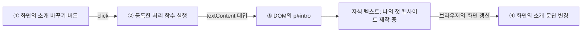

# 02회차 08번 이후 슬라이드 검토안

> **미채택 기록(2026-09-14):** 사용자가 기존 개선안의 페인트 이후 내용을 채택하지 않아, 이후 모든 슬라이드와 부록을 삭제했다. 현재 강의는 **01–14번, 마지막 슬라이드는 「페인트」**이다. 아래 내용은 이전 작업의 기록이며, 현재 강의의 구성·작성·재생성 기준으로 사용하지 않는다.

> **구성 변경(2026-09-14):** 웹 브라우저 렌더링 흐름에 비해 세부적인 설명인 기존 12번 「규칙에서 계산된 스타일로」를 삭제했다. 이후 「클릭에서 문단 변경까지」와 「새 노드의 생성과 추가」도 다음 주 JavaScript 수업 범위로 분류해 삭제했다. 현재 구성은 **본문 46장 + 부록 2장**이다. 렌더링 원리 챕터의 설명 범위는 08–14번이다. 아래 표와 개편 기록의 번호는 당시 구성을 유지하며, 현재 번호는 `materials/figures/slide-map.json`을 따른다.

> **실습 검토 후 정정(2026-09-11):** 아래 개편 기록의 React·정적 HTML 실습 전제는 사용자가 지정한 실제 실습과 다르다. 실습 관련 내용은 [실습 내용과 제작 기준](materials/practice-context.md)을 우선한다. 이 문서의 기존 개편안을 실습 범위의 확정 근거로 사용하지 않는다. 현재 슬라이드와 실제 실습의 차이는 기준 문서 7절에 기록했다.

검토·반영일: 2026-09-11. 검토 대상은 개편 전 본문 08–35번과 부록 A1–A3(문서 순서 36–38번), 원본 PDF 전체 44쪽이다. 아래 검토표는 개편 전 번호를 유지한다. 검토 내용을 슬라이드와 실행 예제에 반영했으며, 최종 구성은 **본문 49장 + 부록 2장**이다.

| 개편 전 | 적용 위치 | 반영 결과 |
| --- | --- | --- |
| 08–11 | 08–11 | 공통 예제 → DOM 노드·속성·텍스트 → CSS 규칙 객체 |
| 12–13 | 12–15 | 계산된 스타일 / 렌더링 박스 / 실측 레이아웃 / 페인트·합성 분리 |
| 14 | 16–17 | textContent 전후, createElement·appendChild와 새 노드 |
| 15–16 | 18–21 | 너비·색상 변경, 실제 Performance 기록, LCP·INP·CLS, 이미지 공간 예약 |
| 17–18 | 22–25 | CSR·SSR·SSG의 실제 소스·응답·동일 결과 화면 |
| 19–21 | 26–31 | URL·파일·화면 대응, MPA·SPA 요청 기록, URL에서 콘텐츠 선택 |
| 22–23 | 32–34 | 실제 Elements·Network 캡처, 공통 예제로 개념 종합 |
| 24–27 | 35–38 | nav 세 곳의 반복, 실제 React 카드, 프로젝트 파일과 화면 |
| 28–31 | 39–43 | Node·CLI 실행 결과, npm 설치·실행, 전체 예제 실행 안내 |
| A1 시맨틱 HTML | 44 | 과제 설계 직전 본문으로 이동, 영역 지도와 태그 대응 |
| 32–35 | 45–49 | 완성 세 화면, 구현 위치, 제출 확인, 예제 자료, Q&A |
| A2–A3 | A1–A2 | 실제 접근성 역할·이름과 키보드, 실제 메타데이터와 검색 개념도 |

자료: [강의 슬라이드](index.html), [실행 예제와 소스](examples/index.html), [예제 ZIP](materials/week2-examples.zip). 원본의 Svelte 파일명은 현재 수업의 React·Vite 예제로 바꾸어 파일·컴포넌트·화면 대응을 복원했다. 상세 상태·훅, API, 배포는 기존 후속 회차의 범위로 유지하며 이번 개편으로 해당 회차의 내용을 수정하지 않았다. 원본의 근거 없는 프레임워크 성능 순위와 과거 성능 지표는 재사용하지 않았다.

원본: [Week 2 PDF](<materials/[Week 2] 웹 개발 핵심 개념 이해와 웹 프레임워크를 활용한 개발 및 배포.pdf>). 페이지 번호는 표지를 포함한 PDF 페이지 순서다.

이번 개편에서는 주제의 순서를 정리하는 데 집중한 나머지, 학생이 코드를 보고 개념을 확인할 수 있는 근거를 충분히 만들지 못했다. 특히 **코드의 특정 부분 → 브라우저 내부의 대상 → 화면에서 관찰할 결과**를 학생이 스스로 연결해야 하는 상태다. 발표·인쇄 화면의 넘침 검사와 코드 린트 통과는 이 교육적 결함을 검증하지 못했다.

**현재 자료에서 확인한 문제**

- 10·11번에 코드와 트리가 있지만 같은 요소·속성·값을 연결하는 표시가 없다. 두 자료를 병렬 배치한 것만으로 대응 관계가 설명되지는 않는다.
- 09·12·15번은 개념 이름을 상자와 화살표로 연결했다. 해당 단계의 입력과 출력이 어떤 모습인지 부족하다. 특히 12번은 렌더 트리를 설명하지만 실제 트리가 보이지 않는다.
- 13번은 화면 모형 세 개를 보여 주지만 레이아웃의 좌표·크기, 페인트 대상, 합성할 레이어의 내용과 경계를 구체적으로 보여 주지 않는다.
- 14번의 실행 예시는 의미가 있으나 코드 줄과 변화한 DOM을 연결하지 않는다. 배열과 나머지 연산이 핵심 동작을 가리며, PDF로 보면 클릭 전후의 차이를 확인할 수 없다.
- 18·21번은 특징·장단점과 처리 순서를 읽어야 한다. 응답 HTML, 실행 코드, 실제 document 요청 여부가 없다.
- 22번은 개발자 도구에서 할 일을 적었지만 학생이 찾아야 할 화면과 확인 결과가 없다.
- 25–30번은 반복 작업, 프레임워크, 런타임, 패키지 등 추상적인 설명이 많다. 실제 파일과 코드·명령 실행 결과가 부족하다.
- 시맨틱 HTML을 부록으로 옮겼는데 32·33번 과제는 시맨틱 구조를 필수로 요구한다. 본문 학습과 과제 요구사항이 맞지 않는다.

**원본 PDF의 자료를 활용하는 방식**

| 원본 PDF | 원본에서 확인한 자료 | 현재 자료의 상태 | 반영 방향 |
| --- | --- | --- | --- |
| 4–6쪽 | 자기소개 HTML·CSS·JavaScript, 요소 선택과 텍스트 변경 | 자기소개 예시는 유지했으나 단계별 대응 표시 부족 | 하나의 실제 예제 프로젝트에서 필요한 줄을 발췌하고 동일한 대상에 번호·색상 부여 |
| 7쪽 | HTML, DOM 트리, 요소 찾기·내용 변경·스타일 변경·새 요소 추가 코드 | DOM·텍스트 변경만 중심적으로 남음 | HTML↔DOM 연결 도식 보강, 요소 생성·추가도 별도 상태 변화 사례로 복원 |
| 8쪽 | 일반 컨테이너와 시맨틱 마크업 비교, 검색 과정 | 부록으로 이동 | 코드 비교에 페이지 영역 지도를 추가하고 시맨틱 HTML은 과제 설계 전에 본문 편입 |
| 9쪽 | HTML/DOM·CSS/CSSOM의 분기와 렌더 트리 합류 그림 | 큰 흐름은 있으나 입력·출력 모양이 생략됨 | 코드 조각·실제 노드·스타일 값을 담은 도식으로 다시 작성 |
| 10–11쪽 | CSR/SSR/SSG 설명, 성능 측정 화면 | 문구·지표 중심 | 원본도 코드 설명이 부족한 부분이므로 응답 HTML·시간축·실제 관찰 자료를 새로 보강 |
| 12–14쪽 | URL 분해 도식, MPA/SPA 흐름도, DevTools 화면 | URL 구분과 흐름은 일부 유지, 도구 화면은 제거됨 | 실제 링크 코드·파일 경로·요청/응답·선택된 DOM 화면으로 구체화 |
| 17–19쪽 | Node.js 화면, 터미널 화면, npm/npx 명령 | 특징 목록과 짧은 명령만 남음 | 같은 JS 파일의 실행 결과, 터미널 각 부분의 설명, package.json과 명령의 대응 추가 |
| 22–25쪽 | Svelte 파일 코드, 프로젝트 트리, 파일과 URL 매핑 | 이에 대응하는 구체적 설명이 없음 | 현재 강의의 HTML 프로젝트 및 React·Vite 프로젝트로 교육 목적을 옮김 |
| 26–34쪽 | 상태·조건·반복·이벤트·생명주기·props·바인딩·컴포넌트 코드 | 이름 또는 개요 수준으로 축소 | 이벤트·DOM 변경·컴포넌트 재사용은 이번 회차에서 구체화. 상세 JS/TS·React 문법은 해당 회차로 이관 |
| 35–36쪽 | API 요청 코드, 응답 데이터, 컴포넌트의 데이터 사용 | 현재 2회차 범위에서 제외됨 | 6회차 API 및 통합 수업에서 요청→JSON→화면 대응 자료로 보존 |
| 37쪽 | 코드와 실행 화면을 함께 보는 Playground | 공통 실행 예제 부재 | 이번 강의용 실행 가능한 예제 폴더를 제공하고 슬라이드 발췌와 연결 |
| 39–43쪽 | CI/CD·배포 절차·실습 요구사항 | 다른 주차 계획과 GitHub Pages 과제로 변경됨 | 이번 과제는 GitHub Pages의 결과 확인을 보여 주고, 상세 배포 자동화는 9회차 자료로 이관 |

원본은 2025년 SvelteKit·Vercel 수업이다. 현재 `lectures/shared/lecture-deck.js`에는 3회차 JavaScript→TypeScript, 4회차 React+Vite, 6회차 Backend+REST API, 9회차 Deployment가 설정되어 있다. 원본의 설명 방식을 살리면서 현재 수업 기술과 과제에 맞는 코드로 바꾸는 것을 권장한다. 원본 전체를 2회차에 되넣어 문법의 양을 늘리는 방식은 피한다.

**공통 제작 기준**

1. 예제는 자기소개에서 Home·About·Projects의 개인 사이트로 확장한다. 슬라이드마다 새로운 도메인·데이터·파일명을 만들지 않는다.
2. 개념 설명 슬라이드에는 그 개념을 확인할 수 있는 코드 또는 실제 관찰 자료를 둔다. 파일명과 발췌 범위를 표시하고 관련 부분만 강조한다.
3. 코드와 도식은 같은 번호·이름·값으로 연결한다. 예를 들어 `id="intro"`, `#intro` 노드, 화면의 소개 문단을 모두 ①로 표시한다. 색상 외에도 번호와 레이블을 사용한다.
4. 그림은 결과물을 담는다. DOM은 노드와 연결선, CSSOM은 선택자·선언 값, 레이아웃은 박스의 좌표·크기, 네트워크는 실제 요청과 응답 내용을 보여 준다.
5. 변경을 설명할 때는 바꾸는 코드, 변경 전 상태, 변경 후 상태를 함께 둔다. 클릭 실습은 이를 확인하는 수단이며 PDF에도 전후가 남아야 한다.
6. 긴 코드와 여러 관찰을 한 장에 밀어 넣지 않는다. 코드 글자 크기를 줄이지 않고, 개념의 입력→처리→출력이 완결되는 단위로 나눈다.
7. 실제 화면·콘솔·Network·Performance 자료는 같은 예제를 실행하여 캡처한다. 개념도에는 개념도임을 표시하고 임의의 수치를 실측 결과처럼 표시하지 않는다.
8. 학습 참고 링크는 공통 우측 하단 위치를 유지한다. 다음 슬라이드 예고 영역은 만들지 않는다.
9. 챕터 표지·자료 목록·Q&A에는 코드를 억지로 넣지 않는다. 개념을 설명하는 본문에서 코드와 근거가 빠지지 않는 것이 기준이다.

**08–16번: 브라우저의 해석과 렌더링**

| 현재 번호·주제 | 학생이 이해하기 어려운 부분 | 적용할 코드·도식·관찰 | 편집 판단·원본 |
| --- | --- | --- | --- |
| 08 브라우저의 해석과 렌더링 | 챕터 표지이므로 자체로 코드 부재가 문제는 아님 | 현재 챕터 제목 유지. 자기소개 페이지를 대표 이미지로 사용할 수 있으나 상세 설명은 본문에서 처리 | 표지 유지. PDF 3·9쪽 |
| 09 코드에서 화면까지 | `HTML→DOM`, `CSS→CSSOM` 이름만으로 변환 결과를 상상해야 함 | 왼쪽에 실제 `<p id="intro">…</p>`와 CSS 규칙, 가운데에 그 p 노드·규칙 객체, 오른쪽에 동일 문단 표시. HTML과 CSS가 분기 후 스타일 계산에서 합류하는 큰 지도. JS가 DOM을 변경하는 화살표는 실제 코드 대상에 연결 | 큰 흐름을 보여 주는 1장으로 재작성. PDF 4–7·9쪽 |
| 10 DOM | HTML과 ASCII 트리의 각 부분이 연결되지 않음. 화면과도 떨어져 있음 | 코드의 `section`, `p`, `id`, 텍스트에 번호 부여. 박스·선으로 만든 DOM 트리의 같은 대상에 연결. 속성은 요소에 붙인 정보, 텍스트는 자식 노드로 구분. 실제 문단 영역도 함께 강조 | 현재 코드 재사용, ASCII 트리를 대응 표시가 있는 그림으로 교체. PDF 7쪽 |
| 11 CSSOM | CSSStyleSheet·CSSStyleRule 같은 이름이 새로운 암기 대상이 됨. 규칙 객체에서 값이 빠져 있음 | 기존 `body`와 `button` 규칙에서 선택자·속성·값을 표시. 각 규칙을 `selector: button`, `background: #1f6b4a`, `color: white` 카드로 변환. 규칙 객체와 계산된 스타일을 분리해 표시 | CSSOM 내부 API 이름 설명 축소. PDF 5·9쪽 기반 보강 |
| 12 스타일 계산과 렌더 트리 | 규칙 매칭·상속·트리 생성·숨김이 한 장에 섞임. 렌더 트리가 실제로 그려져 있지 않음 | 첫 장: `body`의 color와 `#intro`의 color를 실제 p 노드에 연결하고 최종 적용값을 표시. 두 번째 장: 같은 DOM과 렌더링 박스 구조를 나란히 배치하고 `display: none`인 요소가 박스 생성에서 빠지는 것을 표시. `visibility: hidden`은 공간 유지의 작은 비교 | **2장 분리 권장.** PDF 9쪽 확장 |
| 13 레이아웃·페인트·합성 | 비슷한 화면 모형을 반복하여 세 단계의 차이가 불명확함. 레이어의 실제 대상도 없음 | 레이아웃 장: 실제 CSS의 width·padding에 대응하는 치수선과 줄바꿈, 버튼 좌표 표시. 페인트·합성 장: 배경·글자·테두리의 그리기 대상과 합성할 레이어 내용을 구분. 레이어 분리는 브라우저 판단임을 명시 | **레이아웃 / 페인트·합성으로 분리 권장.** PDF 5·9쪽 확장 |
| 14 JavaScript 문서 변경 | 실행 결과만 바뀌며 코드 줄·DOM 변경이 안 보임. 배열·나머지 연산이 핵심보다 복잡함 | `querySelector`, `addEventListener`, `textContent` 중심의 짧은 코드로 단순화. 클릭→처리 함수→p의 텍스트 노드 교체→화면 문구 변경에 ①②③④ 부여. 전후 DOM과 화면을 고정 표시. 원본의 `createElement`·`appendChild`도 별도 장에서 새 노드와 새 문단의 등장을 표시 | **텍스트 변경 1장 + 요소 생성·추가 1장.** PDF 6–7쪽 복원 |
| 15 변경에 따른 렌더링 작업 | 단계 이름의 암기표가 되어 어떤 변경이 왜 작업을 유발하는지 알기 어려움 | 같은 카드에 width를 바꾼 경우와 background-color만 바꾼 경우를 실제 CSS 전후로 비교. 줄 수·버튼 위치가 달라지는 영역과 색만 달라지는 영역 표시. 대응하는 Performance의 Layout·Paint 구간을 실제 기록으로 확인 | 두 사례 중심으로 재작성. transform·opacity의 조건부 최적화는 별도 심화 사례로 축소. PDF 6·9·11쪽 기반 보강 |
| 16 렌더링 성능과 사용자 경험 | LCP·INP·CLS 정의를 읽어도 사용자가 겪는 상황을 떠올리기 어려움 | LCP는 주요 이미지가 나타나는 시간축, INP는 클릭→작업→다음 표시 시간축, CLS는 늦게 들어온 이미지로 문단이 밀리는 전후 그림. 개선 사례는 ``의 width·height 지정 전후와 공간 예약 결과를 사용 | **지표의 상황 / 한 가지 문제의 개선으로 분리 권장.** PDF 11쪽을 정확한 지표와 실제 사례로 갱신 |

**14번의 구체적인 설명 구성 예시**

아래는 최종 코드 전체가 아니라 슬라이드에서 연결해 설명할 핵심 발췌다. 배포 예제에는 HTML과 JS 연결, 실행 시점까지 포함한다. 번호는 코드 내용에 넣지 않고 슬라이드 여백의 표식으로 표시한다.

```html
<p id="intro">웹 개발 학습 중</p>
<button id="change" type="button">소개 바꾸기</button>
```

```js
const intro = document.querySelector('#intro');
const button = document.querySelector('#change');

button.addEventListener('click', () => {
  intro.textContent = '나의 첫 웹사이트 제작 중';
});
```



최종 슬라이드에서는 위 과정을 말로만 연결하지 않는다. 왼쪽 코드의 `#change`·`click`·`textContent` 옆 번호, 가운데 DOM의 교체 전후 텍스트 노드, 오른쪽 브라우저 문단의 교체 전후에 같은 번호를 배치한다. `querySelector('#intro')`가 참조하는 대상이 바로 가운데 p 노드라는 연결선도 필요하다. 클릭 뒤 원본 HTML 파일 자체가 자동으로 수정되는 것으로 오해하지 않도록 원본과 현재 DOM을 구분한다.

**17–23번: HTML 생성 방식과 페이지 이동**

| 현재 번호·주제 | 학생이 이해하기 어려운 부분 | 적용할 코드·도식·관찰 | 편집 판단·원본 |
| --- | --- | --- | --- |
| 17 HTML 생성 방식 | 앞의 브라우저 렌더링과 CSR/SSR/SSG의 용어를 같은 단계로 혼동할 수 있음 | 표지의 초점을 ‘초기 콘텐츠를 만드는 위치와 시점’으로 유지. 이후 사례에서 모두 같은 브라우저 렌더링 경로로 들어가는 것을 보여 줌 | 표지 유지. PDF 10쪽 |
| 18 CSR·SSR·SSG | 장단점 문장으로 비교하여 실제로 받는 HTML이 어떻게 다른지 없음 | 같은 자기소개 데이터를 사용한 3장. CSR: 초기 응답의 빈 콘텐츠 영역→브라우저 JS→DOM. SSR: 요청→서버의 HTML 생성 코드→콘텐츠가 든 응답. SSG: 빌드 코드→생성된 HTML 파일→요청 시 파일 제공. 각 장에 실행 위치·시점·실제 응답 발췌·같은 최종 화면 표시 | **CSR / SSR / SSG 3장 분리.** 마지막에 위치·시점·응답을 짧게 비교. PDF 10쪽 설명을 코드 사례로 확장 |
| 19 라우팅 | 표지는 유지 가능 | 동일 개인 사이트의 Home·About·Projects 화면을 대표 도식으로 사용. 경로에 맞는 화면 선택이 챕터의 대상임을 표시 | 표지 유지. PDF 12쪽 |
| 20 URL 구조와 라우팅 | URL 부분의 이름은 있지만 실제 `<a>`·파일·화면과 연결되지 않음. 임의 경로를 동적 세그먼트라고 단정하는 것도 부정확함 | `<a href="./projects.html?sort=date#featured">`에서 주소 각 부분을 브라우저 URL에 연결. `projects.html` 파일과 `id="featured"` 영역을 표시. 서버 요청 부분과 브라우저가 처리하는 fragment 구분. 동적 경로는 `/projects/:slug` 같은 라우트 규칙이 있는 경우에만 별도 설명 | URL 설명과 실제 파일 매핑을 보강. 복잡하면 2장으로 분리. PDF 12·24–25쪽의 대응 방식 활용 |
| 21 서버·클라이언트 라우팅 | 말풍선 수준의 처리 순서이며 새 문서와 DOM 교체의 실체가 없음 | MPA와 SPA의 실제 이동 예제를 각 1장으로 비교. 브라우저·서버의 세로 시간축 사이에 요청 URL·HTML 또는 필요한 데이터 표시. 기본 링크 코드와 클릭 처리·DOM 교체 코드 표시. Network의 document 요청 유무, 유지되는 헤더와 바뀌는 본문을 화면에서 강조 | **MPA / SPA 2장 분리.** 모든 SPA 이동이 JSON 요청을 발생시키는 것으로 그리지 않음. PDF 13쪽 확장 |
| 22 개발자 도구 | 도구 사용 지시만 있고 따라 볼 화면과 성공 결과가 없음 | Elements 장: p#intro 선택 영역·Styles·Computed를 확대하고 코드와 같은 번호 부여. Network 장: document 행·Response HTML·DOM에만 추가된 텍스트를 연결. Performance 기록은 15·16번 사례에 배치 | **Elements / Network 2장 권장.** PDF 14쪽 화면 자료의 교육적 역할 복원 |
| 23 핵심 개념 정리 | 학습 목표와 유사한 추상 문장을 다시 읽게 됨 | 완성된 개인 사이트를 중앙에 두고 실제 p 노드, CSS 규칙, 클릭 변경 영역, 최초 HTML 응답, About 링크에 콜아웃. 주변에는 이미 배운 코드 한 줄과 짧은 의미만 배치 | 실제 예제를 다시 읽는 종합 도식으로 교체. 새로운 용어는 추가하지 않음 |

CSR·SSR·SSG와 MPA·SPA는 장점을 먼저 외우게 하기보다, 실제 HTML과 문서의 교체 여부를 보고 차이를 설명하게 해야 한다. 개별 생성·이동 방식을 설명한 뒤 비교표가 따라오는 구성이 적절하다. SSR과 SSG가 전달한 HTML도 브라우저가 해석하여 그리며, HTML 생성 방식과 이후 이동 방식은 별개의 관점으로 표시한다.

**24–35번: 구체적인 개발 작업과 과제**

| 현재 번호·주제 | 학생이 이해하기 어려운 부분 | 적용할 코드·도식·관찰 | 편집 판단·원본 |
| --- | --- | --- | --- |
| 24 프레임워크·도구 표지 | 표지 자체의 코드 부재보다 이후 내용이 구체적이지 않은 것이 문제 | 동일 개인 사이트를 대상으로 범위를 소개하는 표지 유지 | 표지 유지. PDF 15쪽 |
| 25 직접 작성한 웹페이지의 한계 | 마크업·상태·최적화·배포의 문제를 경험 없이 한꺼번에 설명 | index.html·about.html·projects.html의 동일한 nav 코드 세 조각을 나란히 배치. 메뉴 문구 하나를 바꿀 때 세 파일을 수정하는 위치 표시. 반복되는 카드도 같은 방식으로 확인 | 반복 코드와 수정 작업 한 가지에 집중. PDF 23·34쪽의 재사용 설명과 연결 |
| 26 웹 개발 프레임워크 | ORM·미들웨어·ISR·쿠버네티스까지 미학습 용어가 많고, ‘도와준다’는 설명만 있음 | React의 짧은 ProjectCard 코드와 `<ProjectCard title="시간표" />` 등 두 사용 위치, 렌더링된 카드 두 개를 연결. 입력 title→코드의 `{title}`→화면 제목을 같은 표시로 연결. 프레임워크가 돕는 반복 작업을 이 사례로 설명 | 컴포넌트 사례 중심으로 전면 재작성. 상세 React 상태·훅 문법은 4회차. PDF 22·32·34쪽의 설명 방식 활용 |
| 27 프론트엔드 프레임워크 비교 | 번들 크기와 ‘좋음/매우 좋음’은 측정 조건이 없고 코드 이해에도 도움이 적음 | 본문은 ‘프로젝트 파일과 화면’으로 교체 권장. 현재 수업의 src/main.jsx·App.jsx·ProjectCard.jsx·CSS·package.json 트리와 코드 발췌를 실제 화면 영역에 연결. 원본의 SvelteKit 파일명을 React·Vite의 자동 라우팅 규칙처럼 옮기지 않음 | PDF 23쪽의 파일 트리·편집기 대응 복원. 프레임워크 비교가 필요하면 동일 기능 코드와 확인 가능한 차이를 별도 참고 자료로 제공 |
| 28 Node.js | 런타임을 정의하며 비동기 I/O·이벤트 루프까지 새 개념을 연속해서 도입 | demo.js의 간단한 JS 코드와 `node demo.js` 실행 결과를 연결. 같은 JS를 브라우저 Console에서 실행한 결과와 나란히 배치. 브라우저의 DOM API와 Node의 실행 환경 차이를 경계 그림으로 표시 | ‘브라우저 밖에서 JS 실행’ 한 가지에 집중. PDF 17쪽보다 실행 증거를 보강 |
| 29 CLI | 터미널·셸·프롬프트·경로가 모두 문장 정의로 제시됨 | 실제 터미널에서 프로젝트로 이동하고 demo.js를 실행한 화면. 창, 셸, 현재 경로, 명령, 인자, 출력에 번호를 붙임. 파일 트리에서 demo.js의 위치를 같은 번호로 연결 | 장점 목록 축소, 캡처와 명령 해부 중심. PDF 18쪽 화면 활용 방식 복원 |
| 30 NPM·NPX | 명령은 있으나 package.json·설치 파일·실행 도구와의 관계가 없음. ‘설치 없이’ 설명도 부정확함 | package.json의 dev 스크립트와 `npm run dev` 연결. 설치 명령→의존성·node_modules, 실행 명령→로컬 도구, npx→로컬 또는 캐시의 실행 파일을 도식화. 동일한 정적 사이트 예제에 쓰는 도구를 사용 | 설치 / 실행이 한 장에 과밀하면 2장 분리. PDF 19·23쪽 보강 |
| 31 오늘의 개념이 이어지는 곳 | 주차 로드맵은 코드 이해를 보완하지 않으며 준비 명령도 결과가 없음 | ‘예제 실행과 결과 확인’으로 교체. 받은 프로젝트 폴더→터미널 명령→표시된 로컬 주소→세 페이지의 링크 동작을 캡처로 연결. Node/npm 설치 확인 명령에는 실제 출력 위치를 표시 | 실행 순서를 완결하는 실습 자료로 교체. PDF 19·23·37쪽의 역할을 현재 예제로 통합 |
| 32 과제 표지 | 과제의 완성 모습이 보이지 않음 | Home·About·Projects의 결과 화면 세 개와 이동 화살표. 공통 nav, 각 페이지의 다른 내용, DOM 상호작용 영역에 표식 | 결과 예시가 있는 표지로 보강. PDF 42–43쪽 |
| 33 과제 개요 | 요구사항을 코드의 어느 위치에서 구현하고 어떻게 확인하는지 불명확 | 구현 장: 세 HTML 파일과 공통 CSS·JS 트리, nav 링크 코드, 상호작용 전후. 제출 장: 요구사항↔관찰 결과, 저장소 URL·배포 URL·세 페이지 접근 확인, 기존 마감일 유지 | **구현 예시 / 제출 확인 2장 권장.** 이번 과제와 일치하는 실행 예제와 참고 링크 확인 필요. PDF 43쪽 |
| 34 더 알아보기 | 일반 문서 링크만으로는 강의 예제를 재현하기 어려움 | 강의 전체 예제의 진입 파일·실행 방법·초기 상태 복구 방법을 먼저 제공. 이후 DOM·CSS·성능 문서의 필요한 항목으로 직접 연결 | 예제 자료와 참고 문서의 역할을 구분. 자료 목록이므로 코드·그림을 억지로 추가하지 않음. PDF 37쪽 |
| 35 Q&A | 별도 문제 없음 | Q&A 유지 | 유지. PDF 44쪽 |

과제 참고 링크인 `github.com/ajou-hyunseok-oh/pwd-week2`는 이번 검토에서 공개 API와 main 브랜치 raw 파일 접근이 404를 반환하여 현재 내용을 확인하지 못했다. 저장소의 현재 존재 여부나 기술 구성을 단정할 수 없다. 새 자료를 만들 때에는 현재 과제와 일치하는 예제를 강의 폴더에도 제공하여 링크 접근 여부와 무관하게 복습할 수 있게 하는 것이 적절하다.

**부록의 처리**

| 현재 위치 | 문제 | 적용안 |
| --- | --- | --- |
| A1 / 문서 순서 36 시맨틱 HTML | 필수 과제 내용이 부록에만 있음. 태그 비교에 실제 문서 영역이 빠져 있음 | **과제 설계 직전 본문으로 이동.** 개인 사이트의 header·nav·main·section·article·footer 영역 그림과 해당 태그의 실제 코드 연결. 일반 div와 시맨틱 태그의 코드는 같은 콘텐츠를 사용 |
| A2 / 37 접근성 | 역할·이름·접근성 트리를 설명하지만 접근성 트리가 보이지 않음 | button 코드→접근성 패널의 role·name→Tab 포커스→Enter/Space 실행을 같은 예제로 표시. aria-live의 변경 안내는 실제 보조 기술 확인 결과가 있을 때 함께 제시 |
| A3 / 38 검색 엔진 | 크롤링·색인·검색 결과라는 단계를 이름으로만 제시 | 실제 title·본문 제목·설명·링크 코드와 검색 엔진이 읽을 정보를 연결. 검색 결과는 학습용 도식으로 표시하고 실제 노출 형태나 순위를 보장하는 그림은 사용하지 않음 |

시맨틱 HTML은 브라우저 렌더링 설명 중간에 다시 끼워 넣기보다, 여러 페이지로 과제를 구성하면서 각 영역의 의미를 정하는 위치에 배치하는 것을 권장한다. 접근성과 SEO 심화는 부록으로 유지하되, 본문에서 요구하는 접근성 기본 동작은 실제 버튼 예제에서 함께 확인한다.

**원본을 재사용하면서 바로잡을 설명**

- 원본 11쪽의 Core Web Vitals 구성은 그대로 재사용하지 않는다. 현재의 LCP·INP·CLS를 유지하고, FCP는 보조 로딩 지표로 구분한다. ‘103% 이탈’ 등 분모와 출처가 분명하지 않은 수치는 제외한다. [Web Vitals](https://web.dev/articles/vitals)
- 원본 19쪽과 현재 30번의 npx ‘설치 없이 실행’은 로컬 실행 파일 또는 필요 시 npm 캐시에 받아 실행하는 방식으로 수정한다. [npm npx 문서](https://docs.npmjs.com/cli/v11/commands/npx/)
- URL의 fragment는 요청 때 서버로 전송되지 않는다. 도식에서 서버 요청 화살표에 `#featured`를 포함시키지 않는다. [MDN URI fragment](https://developer.mozilla.org/en-US/docs/Web/URI/Reference/Fragment)
- `pushState` 호출과 화면 교체를 같은 동작으로 그리지 않는다. URL·이력 변경과 DOM 업데이트는 구분한다. [MDN pushState](https://developer.mozilla.org/en-US/docs/Web/API/History/pushState)
- transform·opacity의 합성 최적화는 조건을 갖춘 사례로 설명한다. 모든 변경이 반드시 동일한 단계를 실행하거나 모든 요소가 별도 레이어를 가진다는 그림은 사용하지 않는다. [Rendering Performance](https://web.dev/articles/rendering-performance)
- 원본 21쪽의 단순 번들 크기·성능 등급은 그대로 재사용하지 않는다. 버전·측정 조건 없이 프레임워크의 우열을 가르치는 자료가 되기 때문이다.

**제작 순서와 검토 기준**

먼저 공통 예제 파일과 실제 출력 상태를 정한다. 그 예제에서 10번 HTML→DOM, 14번 이벤트→DOM 변경, 18번 응답 HTML의 차이를 대표 슬라이드로 작성하면 코드·그림·결과의 연결 방식을 검토할 수 있다. 이후 같은 기준을 나머지 슬라이드에 적용한다. 새 슬라이드의 수는 기존 35장에 맞추지 않고 설명 단위에 맞춰 결정한다.

각 개념 설명 슬라이드는 다음 질문에 자료 자체로 답할 수 있어야 한다.

- 지금 설명하는 개념은 어느 파일의 어느 코드에 있는가?
- 코드의 대상은 그림의 어떤 요소·노드·규칙·요청인가?
- 실행하거나 값을 바꾸면 무엇이 유지되고 무엇이 바뀌는가?
- 브라우저 화면·DOM·응답·콘솔 중 어디에서 결과를 확인하는가?
- PDF만 다시 보아도 입력·처리·결과와 전후 차이를 확인할 수 있는가?

코드 포맷·린트와 화면 넘침 검사는 이 기준을 충족한 다음에 실시한다. 코드가 정상 실행되고 배치가 맞더라도, 대응 관계를 학생이 추측해야 한다면 강의 자료 검토를 통과한 것으로 보지 않는다.
